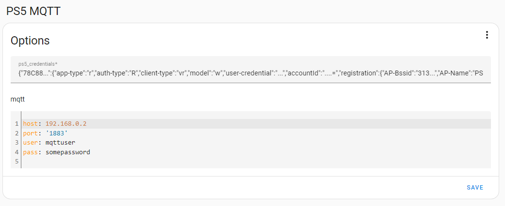

# PS5 MQTT
Integrate your Sony Playstation 5 devices with Home Assistant using MQTT.

[](https://my.home-assistant.io/redirect/supervisor_addon/?addon=PS5+MQTT&repository_url=https%3A%2F%2Fgithub.com%2FFunkeyFlo%2Fps5-mqtt)

## Config



Unfortunately, the feature for acquiring the required credentials to communicate with your Playstation device is not *yet* supported through the add-on itself.
<br>
So for now you will have to create the credentials using the [playactor cli](https://github.com/dhleong/playactor). To use the Playactor CLI you will have to install node.js. You can generate the credentials using the following command:

```
playactor login
```

If succesful, this will create a `credentials.json` file located at `~/.config/playactor/credentials.json`.

Afterwards paste the contents of the credentials file in the add-on config.

## Features
The following features have been implemented or are planned for future implementation.

| Feature                                         | Implemented |
| ----------------------------------------------- | ----------- |
| Power; Wake/Standby (rest mode)                 | ✅           |
| Discover Playstation 5 devices on local network | ✅           |
| Web UI for managing devices                     | ❌           |
| Web UI for acquiring credentials                | ❌           |

## Thanks & Credits
The majority of the MQTT implementation was based on the work done by [andrew-codes](https://github.com/andrew-codes) and can be found in [this repository](https://github.com/andrew-codes/home-automation).
